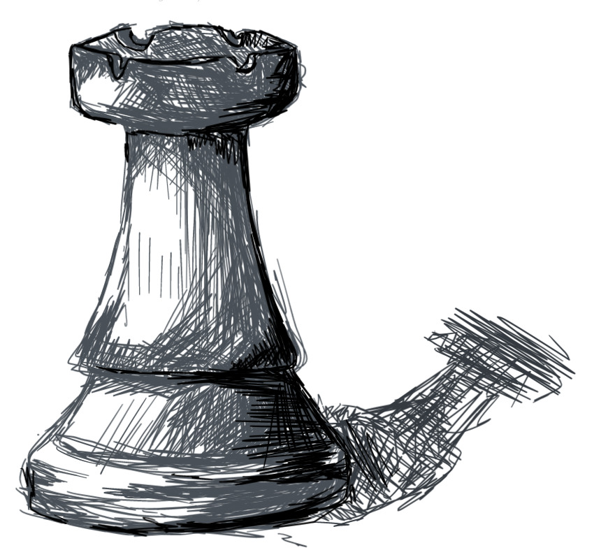

# ProjetoAAA

RL vs Genetic Algorithm in kung fu chess

Santiago Benites fc54392

Joao Ferreira fc55312

# Setting Up and Dependencies

To run this project we recommend [rye](https://mitsuhiko.github.io/rye/)
After installing it with the [shims](https://mitsuhiko.github.io/rye/guide/installation/), you will just have to run:
```bash
rye sync
```
At the root of the project.


